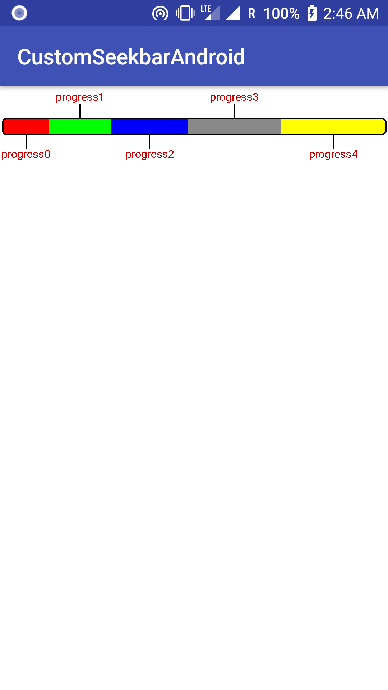

# customSeekBarAndroid
Custom seek bar/ progress bar with customizable multiple color on background. The sections are customisable and clickable.



Setup
--------
#### Gradle

If you are using the Gradle build system, simply add the following dependency in your build.gradle file:
```
dependencies {
    implementation 'com.github.ranaparamveer:customSeekbarAndroid:+'
}
```
And add : 
```maven { url 'https://jitpack.io' } ```

to project level gradle file under allprojects as:
```
allprojects {
    repositories {
        google()
        jcenter()
        maven { url 'https://jitpack.io' }
    }
}
```

You can use the custom view in following manner:

#### In XML:

```
  <com.phappytech.customseekbarandroid.CustomSeekBar
        android:id="@+id/custom"
        android:layout_width="wrap_content"
        android:layout_height="wrap_content"
        android:padding="5dp"
        app:arrowColor="@color/colorAccent"
        app:borderColor="@color/colorPrimary"
        app:showArrows="true"
        app:showDummyData="true"
        app:showProgressOnOnClick="false"
        app:showText="true"
        app:textColor="@color/colorPrimary"
        app:textPadding="10dp"
        app:textSize="14sp" />
        
```

And the values can be passed in you activity class using:

```
ArrayList<ProgressSegment> progressSegments = new ArrayList<>();
        int[] colors = {Color.RED, Color.GREEN, Color.BLUE, Color.GRAY, Color.YELLOW};
        for (int i = 0; i < 5; i++) {
            ProgressSegment progressSegment = new ProgressSegment(Parcel.obtain());
            progressSegment.name = "progress" + i;
            progressSegment.progress = (i + 3) * 10;
            progressSegment.color = colors[i];
            progressSegments.add(progressSegment);
        }
        CustomSeekBar customSeekBar = findViewById(R.id.custom);
        customSeekBar.setProgressSegments(progressSegments);
```

The clickListener to handle clicks on segment can be used as:

```
        customSeekBar.setSegmentClickedListener(new SegmentClickedListener() {
            @Override
            public void onClickSegment(int pos) {
                Toast.makeText(MainActivity.this, "seg: " + pos, Toast.LENGTH_SHORT).show();
            }
        });
```
